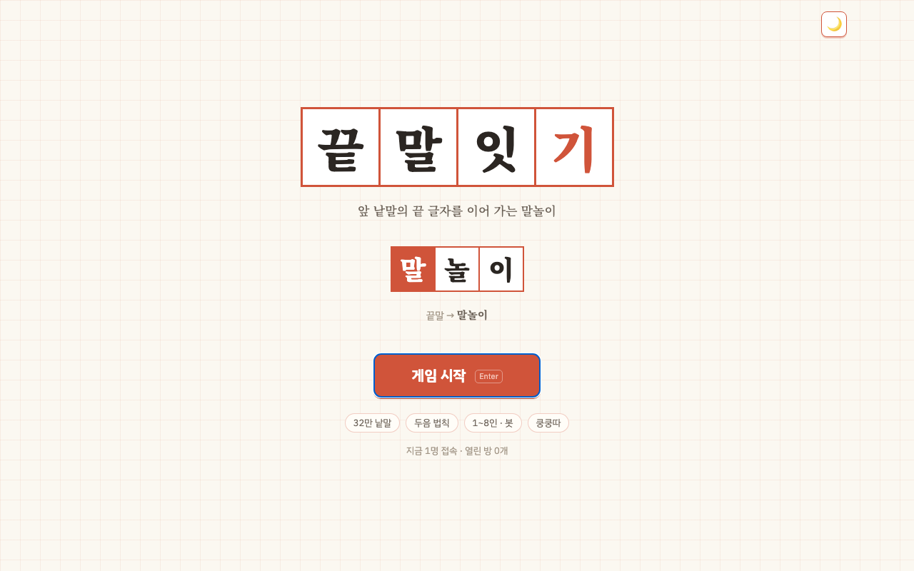

# 끝말잇기

표준국어대사전 · 우리말샘 49만 낱말로 하는 온라인 끝말잇기. 끄투처럼 방을 만들어 여럿이, 혹은 봇과.

https://kkeutmal.41ways.workers.dev/



로컬 실행은 `npm install && npm start` → http://localhost:8820

## 규칙

- 앞 사람 낱말의 끝 글자로 시작하는 낱말을 치고 Enter. 두음 법칙 인정(력→역, 로→노 등, 끄투와 같은 범위).
- 사전에 있는 명사(대명사·수사 포함)만, 두 글자 이상, 한 판에서 한 번씩만. 기본은 방언·옛말·북한말·띄어 쓰는 구도 받고, "표준어만"을 켜면 표준어 명사만 받는다.
- 라운드 첫 낱말은 이을 말이 없는 한방 단어면 안 된다. 그 뒤로는 "한방 금지"를 켠 방에서만 막는다.
- "사전 외 낱말"을 켜면 `dict/injeong/`에 모아둔 포켓몬(1세대)·롤 챔피언·신조어 같은 사전에 없는 말도 받는다.
- 한 판은 여러 라운드. 라운드 수만큼 글자가 있는 제시어가 뽑히고, 라운드마다 그 글자로 새로 시작한다.
- 차례 시간과 라운드 시간이 각각 흐르고, 둘 중 하나라도 다 가면 그 사람이 −50점, 라운드가 끝난다. 차례 시간은 10초에서 이어질 때마다 조금씩 줄어든다.
- 막히면 포기 버튼으로 바로 넘길 수 있다(시간 초과와 동일하게 −50).
- 라운드 시간을 "없음"으로 하면 시계 없이 막힐 때만 포기로 넘긴다.

방 설정(모드, 라운드 수, 시간, 봇 실력, 미션 글자, 한방 금지, 표준어만, 사전 외 낱말, 외래어 금지, 비공개)은 방장이 대기실에서 바꾼다. 빠른 입장은 붐비는 공개 방에 바로 넣어주고, 혼자 연습은 봇 셋과 비공개 방을 만든다.

## 점수

```
기본  = 4 + 4n + n²          (n = 글자 수)
이음  × (1 + 0.04 × 이어진 횟수)   (25번까지)
빠르기 × (0.7 + 0.6 × 남은 차례 시간 비율)
미션  × (1 + 0.5 × 미션 글자 개수)
```

긴 낱말을 빨리, 긴 줄 끝에서 칠수록 점수가 크다. 시간 초과는 −50.

## 봇

실력에 따라 생각 시간과 고르는 낱말이 다르다. 쉬움은 흔한 낱말 위주로 느리게, 어려움은 전체 사전에서 다음 사람이 잇기 어려운 낱말을 빠르게 골라 몰아붙인다. '흔한 낱말'은 hunspell 사전의 명사 3.2만 개 기준.

## 사전

판정에 쓰는 낱말은 총 21만여 개 — 표준국어대사전의 명사·대명사·수사(구·속담 제외) + hunspell 명사 + 우리말샘의 일반어 명사(치맥·와이파이 같은 새말 포함). 뜻풀이는 첫 글자별로 조각내 `public/dict/`에 두고 필요한 것만 받아온다.

만드는 법:

```bash
python3 tools/fetch-stdict.py /tmp/stdict     # 표준국어대사전 XML을 받아 표제어만 뽑는다
curl -O https://raw.githubusercontent.com/spellcheck-ko/hunspell-dict-ko/master/dict-ko-data.yaml
python3 tools/fetch-opendict.py /tmp/opendict   # 우리말샘 XML을 받아 명사 뜻만 뽑는다
python3 tools/build-dict.py /tmp/stdict/stdict.tsv dict-ko-data.yaml /tmp/opendict/opendict.tsv
```

## 구조

```
game.js              사전 · 두음 법칙 · 판정 · 차례와 라운드 · 점수 · 봇 · 방 목록
worker.js            Cloudflare Workers 서버 (실제 서비스)
server.js            Node 서버 (로컬 개발 · 시험)
dict/words.txt       판정용 낱말 목록
public/dict/*.json   뜻풀이 조각
public/              index.html · style.css · app.js — 화면
tools/                사전 만드는 스크립트
test/                 판 로직 · 서버 확인
```

서버가 판정을 쥐므로 화면을 조작해도 낱말이나 점수를 속일 수 없다.

## 개발

```bash
npm install
npm start                                          # http://localhost:8820
npm test                                           # 판 로직 시험
node test/smoke.js http://localhost:8820           # 떠 있는 서버
npx wrangler deploy                                # 배포 — 푸시만으로는 반영 안 됨
```

무료 플랜이라 20분 동안 조작이 없으면 연결을 닫는다. 화면을 다시 누르면 이어진다.

## 저작권

코드는 MIT. 낱말과 뜻풀이(`dict/`, `public/dict/`)는 국립국어원 표준국어대사전(CC BY-SA 2.0 KR)과 hunspell-dict-ko(CC BY-SA 4.0)에서 뽑아 다듬은 것으로 같은 조건을 따른다. 끄투(KKuTu)의 규칙에서 영감을 받았지만 끄투의 코드나 그림은 쓰지 않았다.

비영리 개인 프로젝트입니다. 문의: gyolno2@naver.com
